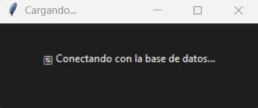
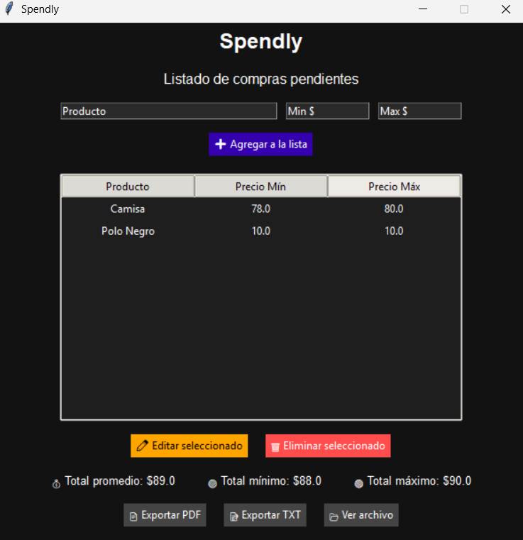

## Spendly

  


This is a small project to apply knowledge with NoSQL database, in this project MongoDb is used to make a calculation of the expenses that we will have, in a list made with the purpose of adding items that in the future we will be buying, therefore, calculate the total, minimum and maximum expenses.
---
## 📥 Technologies

This project is powered by:

- **Python** – The programming language used in the development.
- **Tkinter** - This tool was used to create the GUI in the program.
- **Docker** - Docker is required to use the right container for MongoDB.
- **MongoDB** - And just speaking of MongoDB, we are going to use this database for the program.

---
## ⚙️ Installation

If you want to download it or adapt it to your environment, follow the steps to run it on your local computer:

```bash
git clone https://github.com/Luis3Fernando/Luminle
```
```bash
cd Luminle
```
```bash
npm install
```

```bash
npm run dev
```
---
## 🛠 How to use? 





