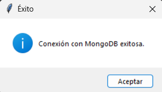
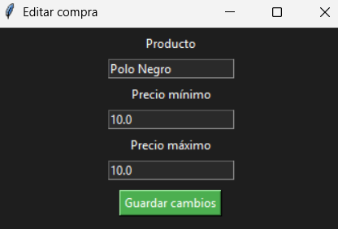

## Spendly

  


This is a small project to apply knowledge with NoSQL database, in this project MongoDb is used to make a calculation of the expenses that we will have, in a list made with the purpose of adding items that in the future we will be buying, therefore, calculate the total, minimum and maximum expenses.

---
## 📥 Technologies

This project is powered by:

- **Python** – The programming language used in the development.
- **Tkinter** - This tool was used to create the GUI in the program.
- **Docker** - Docker is required to use the right container for MongoDB.
- **MongoDB** - And just speaking of MongoDB, we are going to use this database for the program.

---
## ⚙️ Installation
Follow the steps to run it on your local computer:

Clone the repository and access:
```bash
git clone https://github.com/Luis3Fernando/Spendly
```
```bash
cd Spendly
```
Activate virtual environment and install dependencies:
```bash
python3 -m venv env
```
```bash
pip install -r requirements.txt
```
Start the database, with the file docker-compose.yml
```bash
docker-compose up -d
```
Now we start the program
```bash
pythone app.py
```
Then we can move on to the next section

---
## 🛠 How to use? 
When you run the program you will see the following modal:


And then you will get an informative message about the database connection.


If everything is correct you will see the following interface


You can start filling in the data and the program will do the calculations.

You will be able to edit or delete as you need, as in the following screenshots



You can adapt the code to your needs or collaborate on a cloud software, thank you very much for reading 📕.

